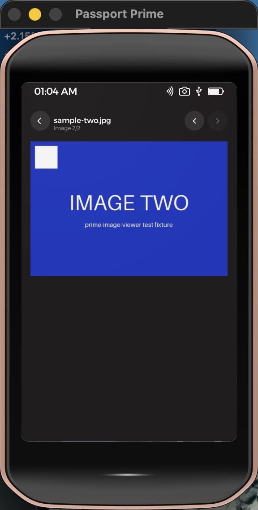

# Image Viewer (Passport Prime)

A read-only image viewer for Foundation's Passport Prime, built on KeyOS with
a Slint UI. Browse Internal / Airlock / USB storage, tap an image (PNG, JPEG,
GIF, BMP), and flip through the folder's images decoded on-device — no cloud,
no write access.

- **Decoding**: the [image](https://crates.io/crates/image) crate 0.25 with
  only its pure-Rust decoders enabled (`png`, `jpeg`, `gif`, `bmp`; no rayon),
  downscaled to fit-to-width; displayed via Slint `Image` from a shared pixel
  buffer.
- **Permissions**: read-only file access (`fs-read` + `fs-access-read`
  templates) — the signed manifest contains no write grants.
- **Testing**: driven end-to-end in the hosted simulator by
  `../ui-automation/tests/view-image.sh` (CoreGraphics taps + screenshot
  color assertions + log assertions).

| Browser | Image one (PNG) | Image two (JPEG) |
| --- | --- | --- |
|  |  |  |

## Build & run

```bash
nix develop ~/.foundation/sdk/current --command foundation build   # signed hardware bundle
nix develop ~/.foundation/sdk/current --command foundation sim     # hosted simulator
```

See `CLAUDE.md` for architecture, and `NOTES.md` for verified build/sim output
and simulator gotchas.
