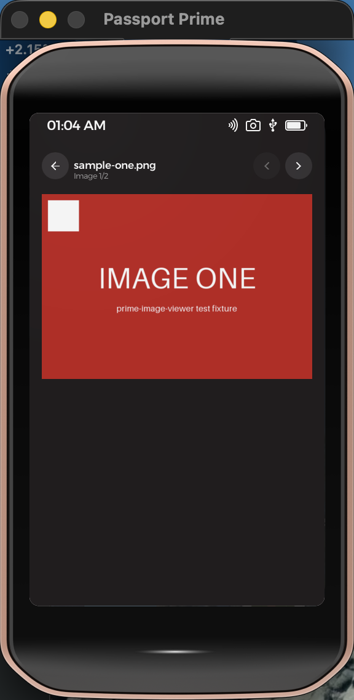
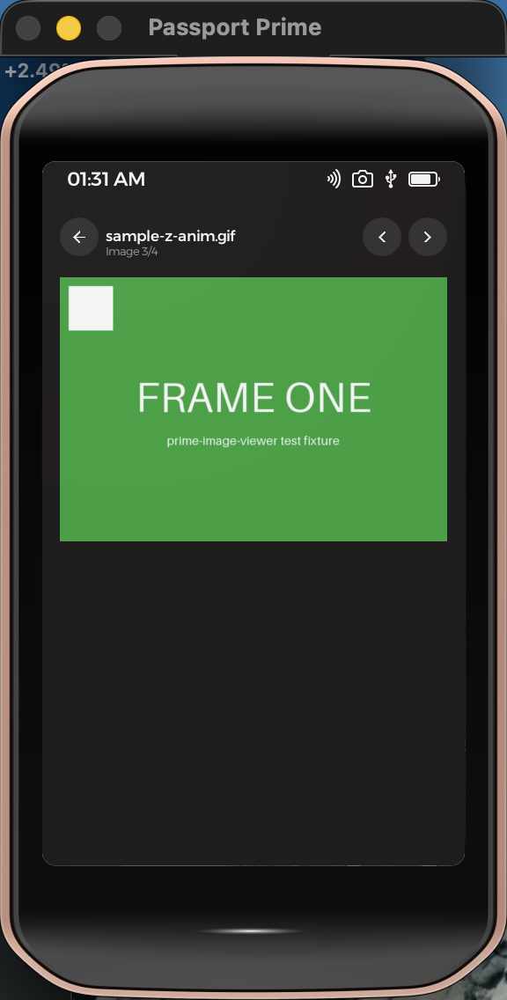
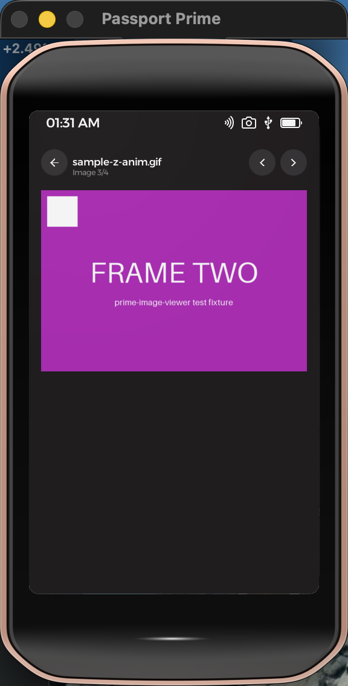

#  Image Viewer — a Passport Prime app

A read-only image viewer for Foundation's **Passport Prime**, built as a Rust
binary with a **Slint** UI on **KeyOS** (Foundation's Rust microkernel on
Xous). Browse Internal / Airlock / USB storage, tap an image (PNG, JPEG, GIF,
BMP), and flip through the folder's images decoded on-device — animated GIFs
play — no cloud, no write access.

<p align="center">
  
  &nbsp;
  
  &nbsp;
  
  &nbsp;
  
</p>

## Details

- **Decoding**: the [image](https://crates.io/crates/image) crate 0.25 with
  only its pure-Rust decoders enabled (`png`, `jpeg`, `gif`, `bmp`; no rayon),
  downscaled to fit-to-width; displayed via Slint `Image` from a shared pixel
  buffer. Animated GIFs are decoded frame-by-frame and cycled with a Slint
  `Timer`.
- **Permissions**: read-only file access (`fs-read` + `fs-access-read`
  templates) — the signed manifest contains no write grants.
- **Testing**: driven end-to-end in the hosted simulator by
  `../ui-automation/tests/view-image.sh` and `view-gif.sh` (CoreGraphics taps
  + screenshot color assertions + log assertions; the GIF test samples the
  screen over time to prove frames actually cycle).

## Build & run

Requires the `foundation` CLI (on `PATH` at `~/.foundation/sdk/bin`) and Nix.
In a non-login shell, source Nix first:

```bash
. '/nix/var/nix/profiles/default/etc/profile.d/nix-daemon.sh'
export PATH="$HOME/.foundation/sdk/bin:$PATH"
```

Then, from this directory (via the SDK's Nix dev shell):

```bash
nix develop ~/.foundation/sdk/current --command foundation sim     # hosted simulator
nix develop ~/.foundation/sdk/current --command foundation build   # compile + sign a hardware bundle
```

> **Hardware sideload** (`foundation sideload`) is **not** possible on a retail
> Prime — it needs dev firmware from Foundation. The simulator is the
> verification target. See `NOTES.md`.

See `CLAUDE.md` for architecture, and `NOTES.md` for verified build/sim output
and simulator gotchas.
