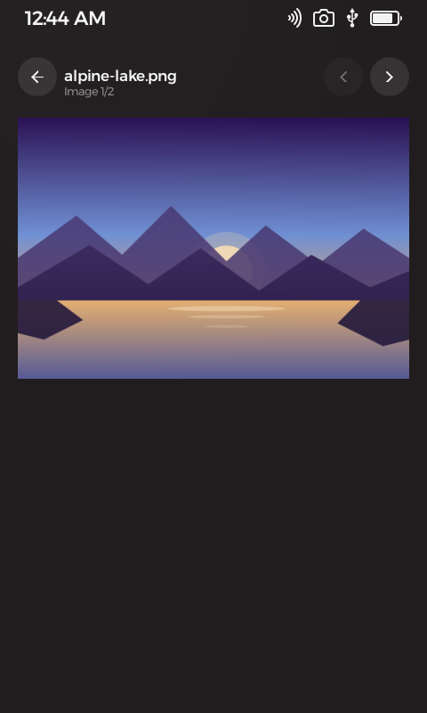
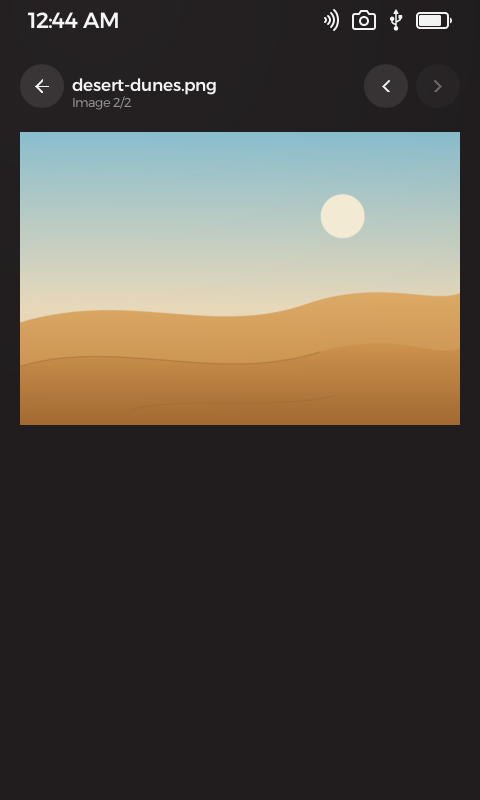
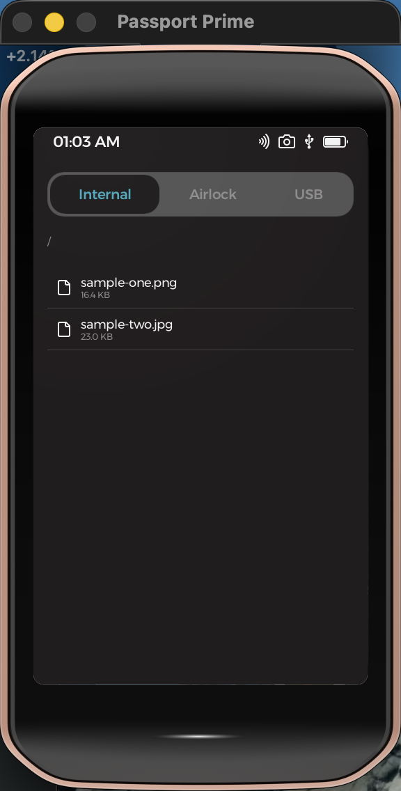

#  Image Viewer

**Media · Images** — view photos and images on your Passport Prime, decoded entirely on-device.

Wallet QR printouts, diagrams, photos moved over USB — Image Viewer opens them right on your Prime. Browse Internal, Airlock, and USB storage, tap an image, and flip through everything in the folder. PNG, JPEG, GIF, and BMP are all decoded on the device — animated GIFs actually play — with no cloud, no companion app, and no write access: it can look at your files but never touch them.

<p align="center">
  
  &nbsp;
  
  &nbsp;
  
</p>

## Features

- **All three storage locations** — Internal, Airlock, and USB, with folder navigation; the list shows just folders and images.
- **Four formats** — PNG, JPEG, GIF, and BMP, scaled to fit the screen with drag-panning for tall images.
- **Animated GIFs play** — decoded frame-by-frame and cycled on-device.
- **Flip through a folder** — previous/next moves between the folder's images, not just pages of one file.
- **Strictly read-only** — the app's signed permission manifest contains no write grants at all; it cannot modify, create, or delete anything.
- **Graceful with bad files** — a corrupt or mislabeled image shows a clear error banner and the app keeps running.
- **Offline by design** — Prime has no network stack; your images never leave the device.

## Get it running

With the Foundation SDK installed, build and launch in the simulator with:

```bash
foundation sim
```

See **[DEVELOPMENT.md](DEVELOPMENT.md)** for environment setup, hardware builds, decoding internals, and testing.

## Learn more

- [DEVELOPMENT.md](DEVELOPMENT.md) — building, running, decoding pipeline, permissions, and testing
- [THIRD-PARTY.md](THIRD-PARTY.md) — libraries this app is built on
- [NOTES.md](NOTES.md) — verified build/sim output and simulator gotchas

## Support

If this app is useful to you, a small bitcoin donation is always appreciated — entirely optional.

<div align="center">


**`bc1qrfagrsfrm8erdsmrku3fgq5yc573zyp2q3uje8`**

</div>

Donations help cover development costs and keep more open-source bitcoin tools coming. No VC funding, no ads, no tracking.

## License & disclaimer

Licensed under the GNU General Public License v3.0 or later — see [COPYING](COPYING).

This software is provided "as is", without warranty of any kind, express or
implied. Use it at your own risk — to the maximum extent permitted by law, the
authors, copyright holders, and contributors are not liable for any claim,
damages, or other liability, including loss of data, arising from this
software or its use.
